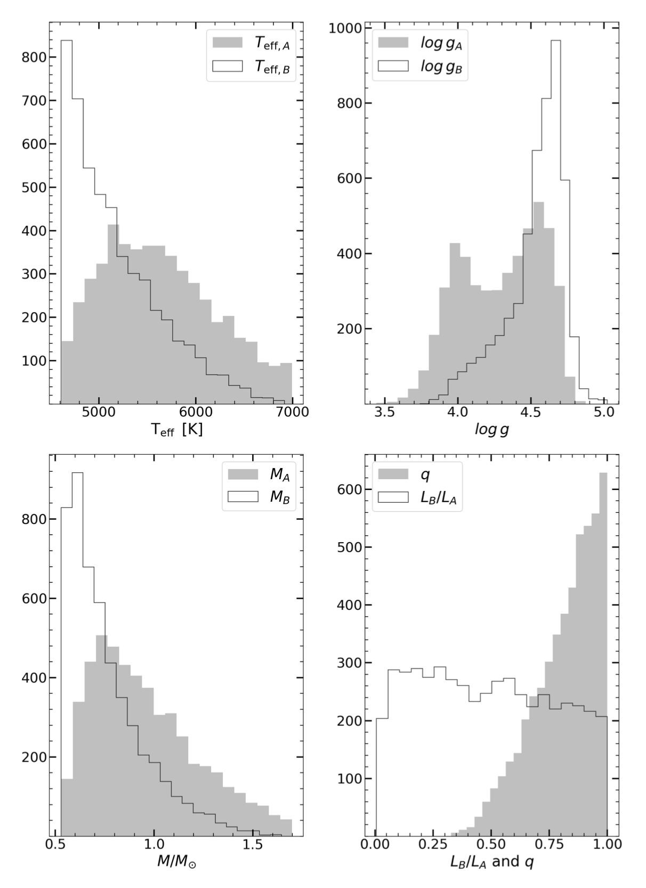

# Binary Population Synthesis

Generates a population of binary stars according to a series of constraints from the literature. The distributions can be changed within the function as well as the sensibility of the algorithm.

For the mass ratio distribution, while there is a lot of debate in the literature, I tested all of the sensible choices I could find and the results seemd to converge towards a fixed parameter mass ratio distribution (given by the parameter filters and the data available from GALAH). Here I show the resulting histogram for the mass ratio distribution for the selected power law from [1], the resting parameters are derived from the conditions applied to the mass ratio.

[1] Duchêne, G., & Kraus, A. (2013). Stellar MultiplicityAnnual Review of Astronomy and Astrophysics, 51(1), 269–310.
